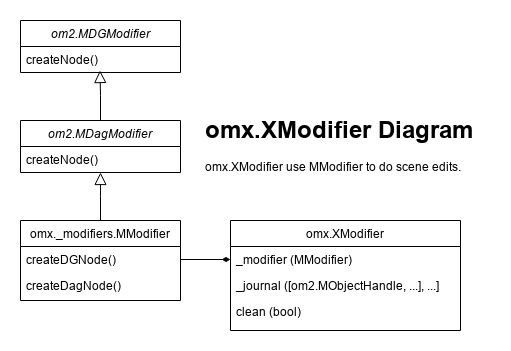

Modifiers
========================

|project| at it's core, relies on Maya om2anim.MAnimCurveChange, ``om2.MDGModifier`` and ``om2.MDagModifier`` to modify the Maya scene data.
Just like Maya's modifiers, after all the edit operations have been called, you need to call
modifier.doIt() at the correct time to execute these operations.

1. First, there are ``om2.MDGModifier`` and ``om2.MDagModifier`` in Maya native API. 
The ``om2.MDagModifier`` inherits from ``om2.MDGModifier`` and comes with extra DAG creation and edit support, 
so we can do pretty much everything with one single ``om2.MDagModifier`` instance, 
except when it comes to the method ``createNode()``. 
``om2.MDagModifier`` overrides ``createNode()`` to only accept DAG node types, passing 
it a DG node type will raise a :class:`TypeError`.

To overcome this, we introduce :class:`AL.omx.utils._modifiers.MModifier`, which derives from 
``om2.MDagModifier``, but with explicit methods ``createDGNode()`` and ``createDagNode()``. For
``createDGNode()``, we explicitly call ``om2.MDGModifier.create(self, typeName)`` instead.

2. Then we introduce :class:`AL.omx.XModifier`, which owns a :class:`AL.omx.utils._modifiers.MModifier`, as 
shown in the graph above. |project| maintains a global list called ``_CURRENT_MODIFIER_LIST``, which contains
a bunch of :class:`AL.omx.XModifier`.

3. By default, :class:`AL.omx.XModifier` has the immediate state turned off. 
When you call :func:`AL.omx.newModifier()`, it creates and pushes a non-immediate :class:`AL.omx.XModifier` instance into ``_CURRENT_MODIFIER_LIST``. 
On the other hand, if you call :func:`AL.omx.currentModifier()`, it gives you the last pushed :class:`AL.omx.XModifier` from
``_CURRENT_MODIFIER_LIST``, if no modifier has ever created and pushed before, it will create and push an immediate :class:`AL.omx.XModifier` 
instance into ``_CURRENT_MODIFIER_LIST``, then return it to you. 

4. When a new Maya scene is created, or before a Maya scene is opened, or Maya quits, 
the ``_CURRENT_MODIFIER_LIST`` will be cleared and emptied. This is ensured during the omx mpx command plug-in load/unload.

.. tip::
   Use :func:`AL.omx.currentModifier()` to retrieve an `XModifier` most of the time, as it has the advantage over the ``om2`` modifier where you won't need 
   to pass the modifier around as arguments.
   Only call :func:`AL.omx.newModifier()` when you need to organize your scene edits using different modifiers or manage the undo yourself.

.. _immediate_mode:

XModifier Immediate Mode
-------------------------------

If :class:`AL.omx.XModifier`._immediate is True, whenever you call its method to edit Maya's scene data, it will call
`doIt()` to apply the edit to the scene immediately. On the other hand, if :class:`AL.omx.XModifier`._immediate is False, then
you'll have to manually call :func:`AL.omx.doIt()` or `XModifier.doIt()` to apply the edit.

This is the case except when it comes to node creation. You can not have a valid `om2.MObject` immediately when creating
a node using a modifier. So regardless of the immediate state, it will always call `doIt()` automatically after node creation.

If you do not call :func:`AL.omx.newModifier()` or manually create a :func:`AL.omx.XModifier()`, and use creation or edit method from 
:class:`AL.omx.XNode` or :class:`AL.omx.XPlug`, it will push an immediate ``omx.XModifier`` into the global list.  
That is why in the script editor when you run omx scripts, it immediately reflects the edit in the Maya scene.

.. note::
   Same as Maya's modifiers, stacking operation and call `doIt()` at the end is of best performance. 
   The immediate :class:`AL.omx.XModifier` does cost you performance.

.. note::
   Calling :func:`AL.omx.doIt()` will call all :func:`AL.omx.XModifier.doIt()` with the global list, and clear the list.
   If you only want to be more specific about applying edits from a certain modifier, use :func:`AL.omx.XModifier.doIt()`.

.. seealso::
   :doc:`undoability`
      Check out the undoability document to see how :class:`AL.omx.XModifier` fits into Maya's undo & redo system.