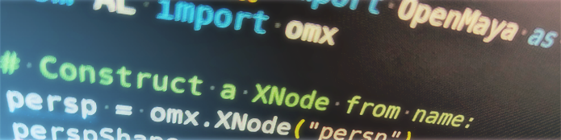

Welcome to |project|!
====================================================================
|project| is a lightweight Python library for use within the 3D application Maya from Autodesk. It is a thin wrapper around the `maya.api.OpenMaya <https://help.autodesk.com/view/MAYAUL/2022/ENU/?guid=Maya_SDK_py_ref_namespace_open_maya_html>`_ (referred as ``om2``) API. 
The current version for |project| is |version|, under the |license|.

.. toctree::
   :caption: Introduction
   :maxdepth: 1

   introduction/why_omx
   introduction/perf_compare

.. toctree::
   :caption: Getting Started
   :maxdepth: 2

   getting_started/installation
   getting_started/quick_samples
   getting_started/cookbook
   getting_started/run_tests
   getting_started/gen_docs

.. toctree::
   :caption: Reference
   :maxdepth: 1

   api/public
   api/utils
   api/private

.. toctree::
   :caption: Technical Details
   :maxdepth: 1

   advanced/modifiers
   advanced/undoability
   advanced/performance
   changes

.. toctree::
   :caption: Feedback & Contributing
   :maxdepth: 1

   feedback/contributing
   feedback/feedback

Indices and tables
==================

* :ref:`genindex`
* :ref:`modindex`
* :ref:`search`
