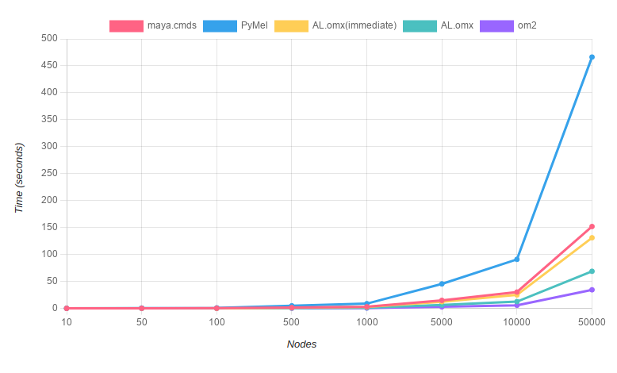

Performance Comparison
=========================

The table below compares the performance of ``maya.cmds``, ``pymel``, ``AL.omx``, ``maya.api.OpenMaya (om2)``, 
when they are dealing with 100+, 1000+, 10000+ nodes. It also shows the performance difference between 
``AL.omx`` in and out of immediate mode.

+-----------------------+--------+--------+-----------------+--------+--------+
| 100+ nodes (seconds)  | cmds   | pymel  | omx(immediate)  | omx    |  om2   |
+=======================+========+========+=================+========+========+
| creation              | 0.1837 | 0.2977 |     0.0825      | 0.061  | 0.0746 |
+-----------------------+--------+--------+-----------------+--------+--------+
| edit                  | 0.0677 | 0.3975 |     0.1692      | 0.0536 | 0.0270 |
+-----------------------+--------+--------+-----------------+--------+--------+
| rename                | 0.0115 | 0.0310 |     0.016       | 0.0055 | 0.0053 |
+-----------------------+--------+--------+-----------------+--------+--------+
| query                 | 0.0082 | 0.1422 |     0.0146      | 0.0101 | 0.0057 |
+-----------------------+--------+--------+-----------------+--------+--------+
| delete                | 0.1156 | 0.1205 |     0.0133      | 0.0069 | 0.0059 |
+-----------------------+--------+--------+-----------------+--------+--------+
| total                 | 0.3868 | 0.9890 |     0.2956      | 0.1371 | 0.1185 |
+-----------------------+--------+--------+-----------------+--------+--------+

+-----------------------+--------+--------+-----------------+--------+--------+
| 1000+ nodes (seconds) | cmds   | pymel  | omx(immediate)  | omx    |  om2   |
+=======================+========+========+=================+========+========+
| creation              | 1.6022 | 2.8140 |     0.9777      | 0.6206 | 0.2677 |
+-----------------------+--------+--------+-----------------+--------+--------+
| edit                  | 0.7045 | 4.1965 |     1.5021      | 0.4553 | 0.1740 |
+-----------------------+--------+--------+-----------------+--------+--------+
| rename                | 0.1246 | 0.3209 |     0.1138      | 0.0606 | 0.0434 |
+-----------------------+--------+--------+-----------------+--------+--------+
| query                 | 0.0819 | 1.4160 |     0.1128      | 0.1231 | 0.0432 |
+-----------------------+--------+--------+-----------------+--------+--------+
| delete                | 0.8158 | 0.6460 |     0.1044      | 0.0777 | 0.0459 |
+-----------------------+--------+--------+-----------------+--------+--------+
| total                 | 3.3291 | 9.3934 |     2.8108      | 1.3372 | 0.5742 |
+-----------------------+--------+--------+-----------------+--------+--------+

+-----------------------+--------+--------+-----------------+--------+--------+
| 10000+ nodes(seconds) | cmds   | pymel  | omx(immediate)  | omx    |  om2   |
+=======================+========+========+=================+========+========+
| creation              |15.7968 |27.2677 |     9.2528      | 7.2431 | 2.4226 |
+-----------------------+--------+--------+-----------------+--------+--------+
| edit                  | 7.0859 |41.1648 |     13.5523     | 4.8801 | 1.7376 |
+-----------------------+--------+--------+-----------------+--------+--------+
| rename                | 1.4020 | 3.4139 |     1.1828      | 0.6959 | 0.5311 |
+-----------------------+--------+--------+-----------------+--------+--------+
| query                 | 0.8260 |14.0232 |     1.2039      | 1.275  | 0.4394 |
+-----------------------+--------+--------+-----------------+--------+--------+
| delete                | 6.2583 | 5.6137 |     1.6232      | 0.9046 | 0.5580 |
+-----------------------+--------+--------+-----------------+--------+--------+
| total                 | 31.369 |91.4833 |     26.815      |14.9987 | 5.6887 |
+-----------------------+--------+--------+-----------------+--------+--------+

The graph below shows the time taken to run each code snippet as the node count scales.

Performance Measuring Code
---------------------------
Common utils used by each script, it needs to be executed first:

.. literalinclude:: ../python/perf_tests/common.py

**maya.cmds:**

.. literalinclude:: ../python/perf_tests/perf_cmds.py

**PyMel:**

.. literalinclude:: ../python/perf_tests/perf_pymel.py

**AL.OMX:**

.. literalinclude:: ../python/perf_tests/perf_omx.py

**maya.api.OpenMaya (OM2):**

.. literalinclude:: ../python/perf_tests/perf_om2.py